# Resolución Espacial Digital y Procesamiento de Imágenes

## Conceptos Fundamentales

- **Resolución espacial digital**: número de píxeles que podemos tener en una imagen.  
  - Mientras más detalles se desean, más píxeles deben colocarse.  
  - Los píxeles se ubican más próximos y la matriz se hace más grande.  
  - Los **puntos de muestreo** (donde se ponen los valores de la matriz) representan la resolución espacial digital.  
  - El número que la caracteriza es la **distancia entre dos píxeles**.  

- **Relación entre resolución y detalle**:  
  - Resolución baja → menos píxeles → menor cantidad de detalles.  
  - Resolución alta → más píxeles → mayor detalle.  

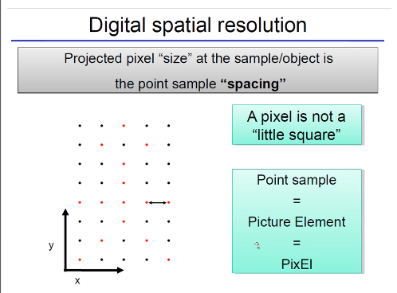

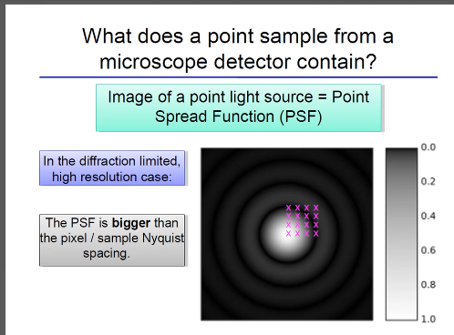

---

## Formación de la Imagen

Cualquier imagen proviene de un sistema físico:  
- Un sistema de lentes capta la luz.  
- Un sensor convierte esa luz en una señal digital.  

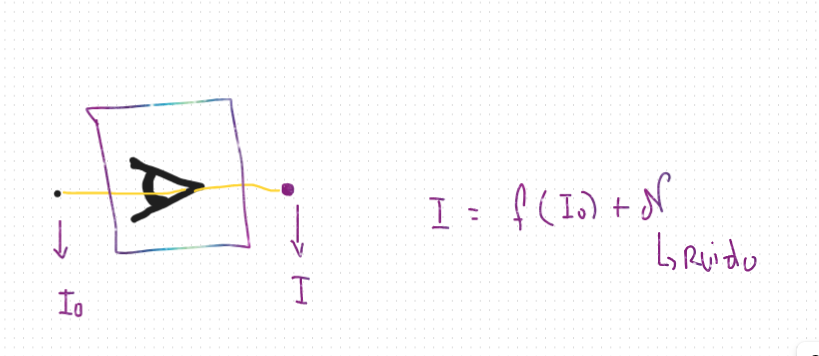

- Lo que queremos analizar es el objeto real **I₀**, pero eso es complejo.  
- El sistema óptico introduce una alteración representada como **f**.  

La **resolución espacial** se define como la mínima distancia necesaria para reconocer y distinguir dos objetos distintos.  

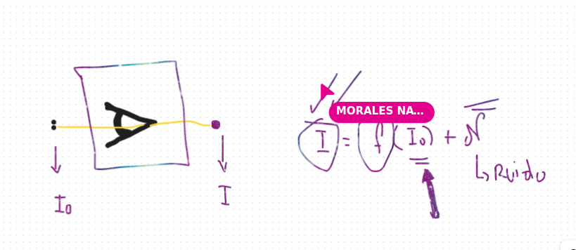

---

## Resolución Digital vs Resolución Espacial

- **Resolución digital**: cada cuánto se coloca un píxel (distancia entre píxeles).  
- Aumentar la resolución digital mejora la resolución espacial percibida.  
- Ejemplo: puntos rojos representan la resolución espacial real, y al añadir puntos azules se simula un aumento digital (oversampling).  

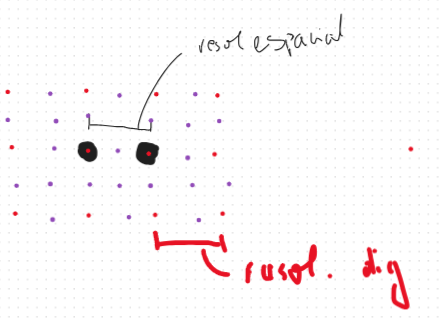

- **Oversampling**: muestreo excesivo, puede añadir redundancia.  
- **Undersampling**: muestreo insuficiente, puede perder información.  

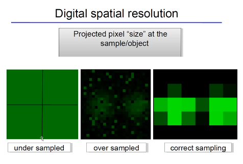

---

## Filtros e Histogramas

- Los **filtros** permiten modificar imágenes, como eliminar ruido.  

- **Histogramas**:  
  - Se dividen los datos en intervalos y se cuenta la frecuencia de aparición.  
  - En imágenes, se grafica la distribución de intensidades de los píxeles.  

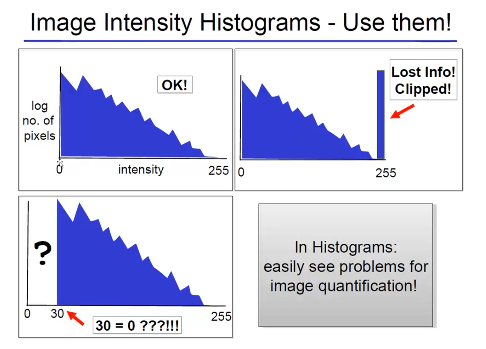

- **Sobresaturación**:  
  - Cuando un valor de píxel excede el máximo permitido (ej. 256 en 8 bits).  
  - Los valores más altos se colapsan en el máximo → zonas blancas.  
  - En otras palabras, se pierde la información de contraste porque los niveles superiores no pueden representarse.  

---

## Parte Práctica – Notebook `Intro_DigitalImages.ipynb` (Secciones 2, 3 y 4)

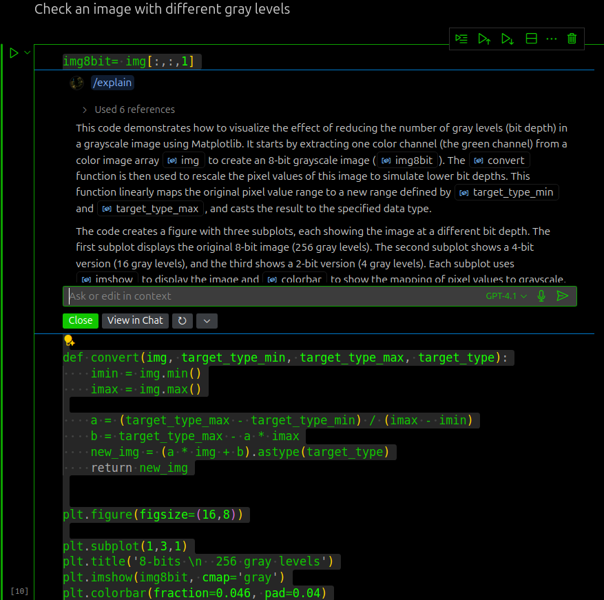

El código demuestra cómo visualizar el efecto de reducir la **profundidad de bits** en una imagen en escala de grises:

1. Se extrae un canal de color (ej. canal verde) → `img[:,:,1]`.  
2. Se crea una versión de 8 bits (256 niveles de gris).  
3. Se aplica la función `convert` para simular profundidades menores.  
   - 4 bits → 16 niveles.  
   - 2 bits → 4 niveles.  
4. Se muestran con `imshow` y `colorbar`.  

Este proceso ilustra cómo menos niveles de gris producen **bandas visibles y pérdida de detalle**.  

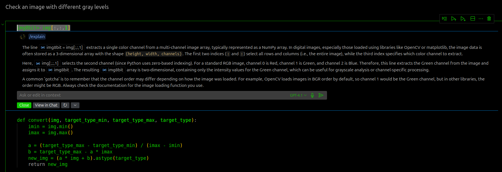

---

## Nota sobre los Canales

- `img[:,:,1]` selecciona un canal de color.  
- En imágenes RGB:  
  - 0 → Rojo  
  - 1 → Verde  
  - 2 → Azul  
- En OpenCV el orden es BGR (0 → Azul, 1 → Verde, 2 → Rojo).  

⚠️ Siempre verificar el orden de canales según la librería usada.  

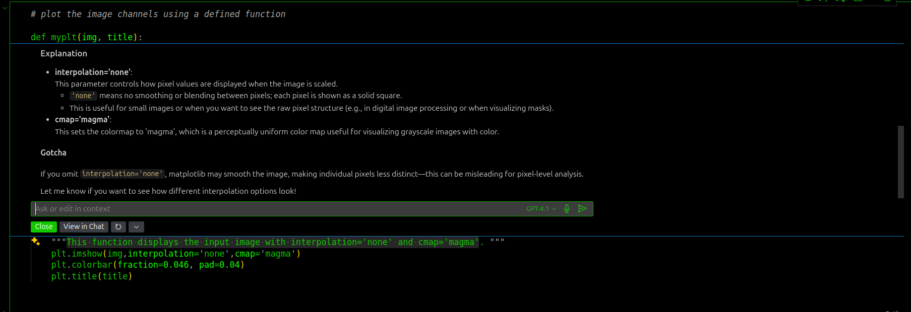

---

## Parámetros en la Visualización

- `interpolation='none'`: muestra los píxeles sin suavizado. Útil para análisis digital.  
- `cmap='magma'`: aplica un mapa de color perceptualmente uniforme.  

ℹ️ Si se omite `interpolation='none'`, Matplotlib suaviza la imagen y puede ocultar la estructura de los píxeles.  

---

## Filtros: Caso Gaussiano

- El **filtro gaussiano** aplica un kernel con forma de campana de Gauss.  
- Se utiliza para suavizar imágenes y reducir ruido.  
- Problema: afecta los bordes (edges).  

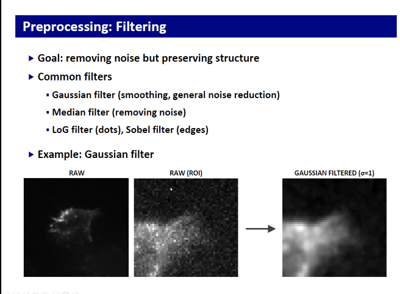
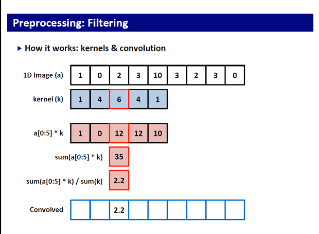
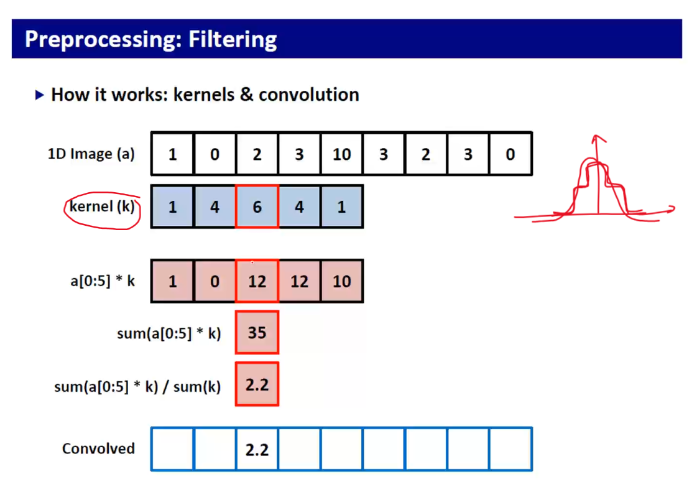

- El kernel actúa como una matriz que pondera los vecinos.  
- El valor resultante de un píxel no depende del original, sino de la combinación con sus vecinos.  

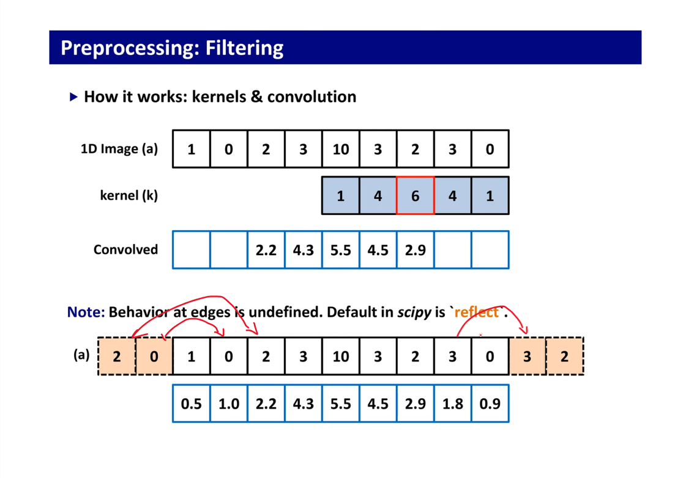

---

## Otros Procesos de Filtrado

- **LoG (Laplacian of Gaussian)**:  
  - Aplica Laplaciano seguido de Gaussiano.  
  - Resalta estructuras tipo puntos.  

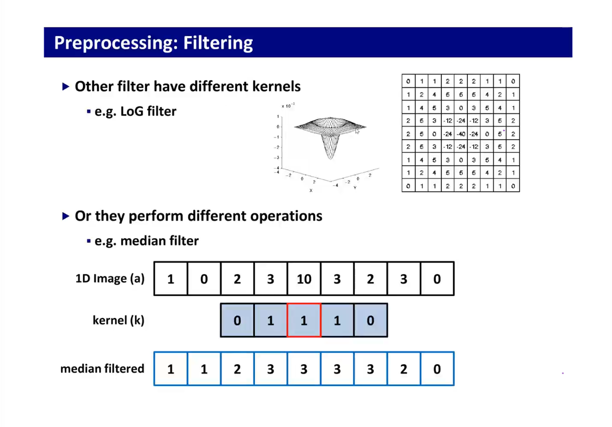